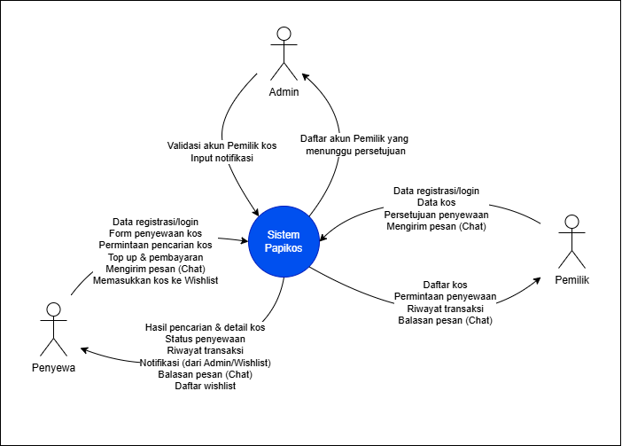
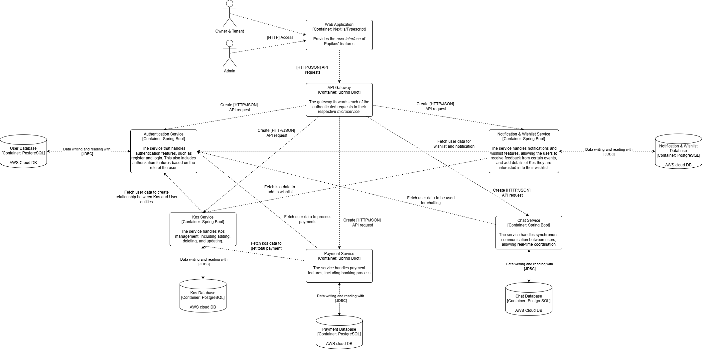
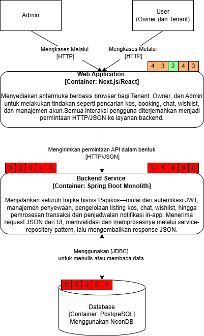
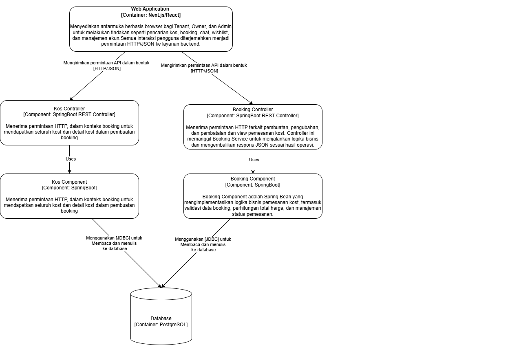
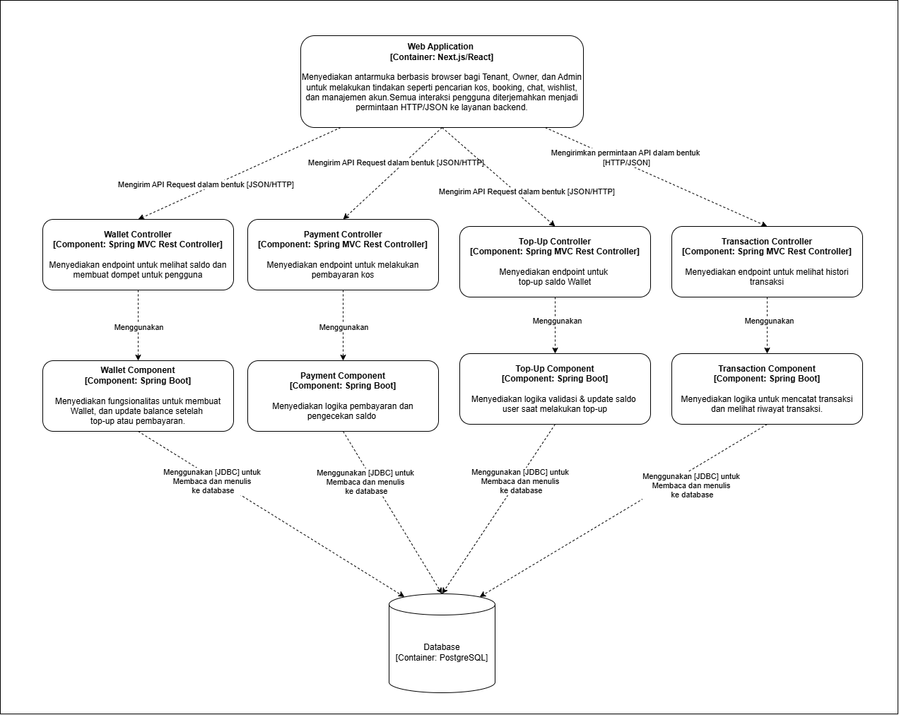
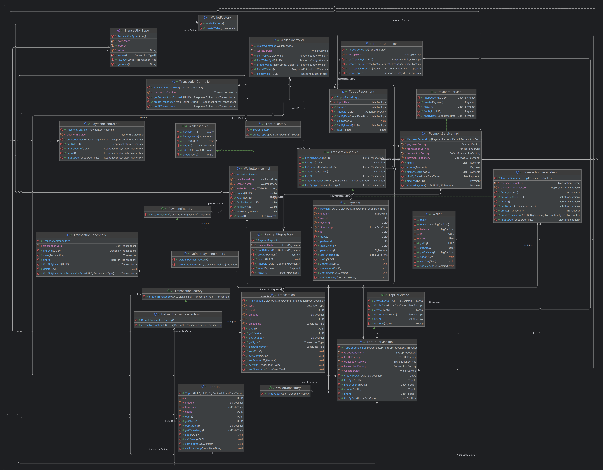
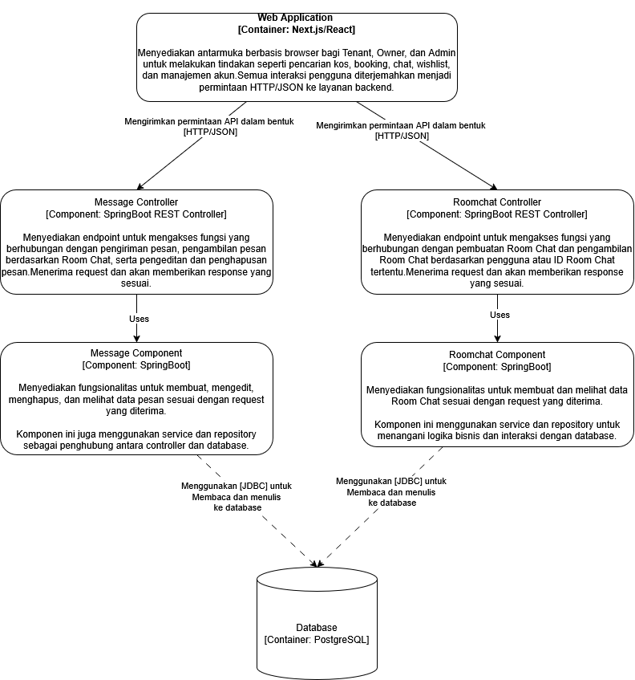

# Papikos
AdvProg 2024-2025 - A15 - PapiKos

## Pembagian Fitur : 
1. Penyewaan Kos : Vincent
2. Pengelolaan Kos : Alex
3. Payment : Nayla
4. Chat  : akhdan
5. Wishlist dan Notifikasi : Abbygail

## Module 9 (Software Architecture)

### Context Diagram

### Container Diagram

### Deployment Diagram

## Future Architecture

## Risk Storming
### Risk Analysis

Ini threats utama yang diidentifikasi di setiap kontainer Papikos:

- **UI bundle size → slowdown**  
  Ukuran bundle JavaScript/CSS yang besar dapat memperlambat waktu muat halaman, memengaruhi pengalaman pengguna terutama pada koneksi lambat.

- **Unvalidated input → SQL/JS injection**  
  Input dari pengguna yang tidak disanitasi berpotensi dieksploitasi untuk serangan SQL injection atau XSS, membahayakan integritas data dan keamanan aplikasi.

- **JWT theft / session hijack**  
  Token autentikasi (JWT) yang dicuri atau berhasil diretas memungkinkan penyerang mengambil alih sesi pengguna dan mengakses data atau fungsi terproteksi.

- **Single-node DB failover / data loss**  
  Saat database utama gagal tanpa replika yang ter-sync, operasi baca/tulis bisa terhenti dan data terbaru berisiko hilang sebelum proses failover selesai.

---
### Risk Consensus

1. **Penempatan Sticky Notes**  
   Setiap threat diberi nilai risiko individu oleh lima peserta, lalu ditempel di diagram kontainer.

2. **Diskusi Outlier**  
   - *JWT theft / session hijack*: beberapa memberi skor Medium, beberapa High → setelah membahas dampak kebocoran sesi, disepakati **9 (Merah, High)**.  
   - *DB failover / data loss*: satu memberi High, lainnya Medium → mengingat replikasi NeonDB, disepakati **6 (Merah, High)**.

3. **Skema Warna & Kategori**  
   - **1–2**: Low (Hijau)  
   - **3–4**: Medium (Kuning)  
   - **6–9**: High (Merah)

## Penjelasan Penerapan Risk Storming

Risk Storming diterapkan untuk secara sistematis mengidentifikasi dan memprioritaskan potensi risiko arsitektur Papikos sebelum masuk ke fase implementasi. Dengan metode ini, setiap anggota tim menilai sendiri–tanpa saling mempengaruhi–tingkat kemungkinan (likelihood) dan dampak (impact) dari threat utama, lalu bersama-sama menyepakati rating akhir. Pendekatan kombinasi penilaian individual dan diskusi kolaboratif memastikan:

1. **Kejujuran Penilaian**  
   Setiap orang bebas menyuarakan kekhawatiran spesifik tanpa bias kelompok.

2. **Pemahaman Bersama**  
   Diskusi outlier mengungkap sudut pandang yang mungkin terlewat, memperkaya pemahaman risiko.

3. **Prioritas Mitigasi**  
   Dengan rating konsensus (Low/Medium/High), tim dapat fokus memperbaiki threat paling kritis secara efisien.

Hasilnya, Papikos mendapatkan peta risiko yang jelas, menunjang arsitektur lebih tahan gangguan dan lebih aman sebelum memasuki produksi.

## Booking (Vincent)
### Component Diagram

### Code Diagram

## Payment (Nayla)
### Component Diagram

### Code Diagram

## Chat (Akhdan)
### Component Diagram

### Code Diagram

## Chat (Alex)
### Component Diagram
.png)

### Code Diagram
.png)
